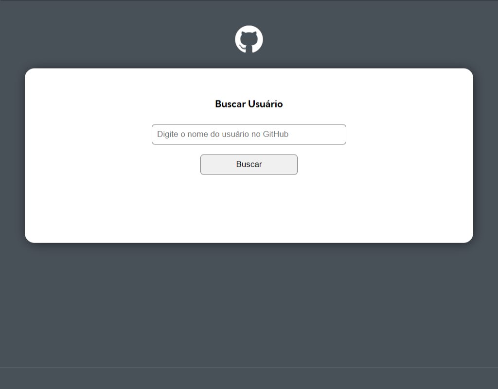
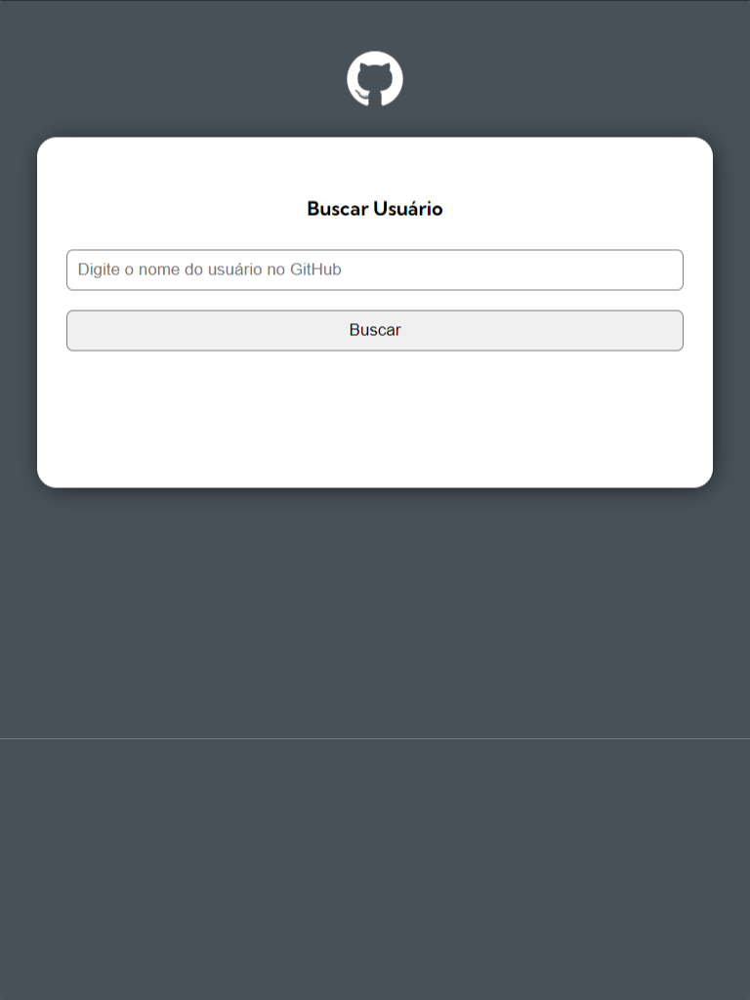
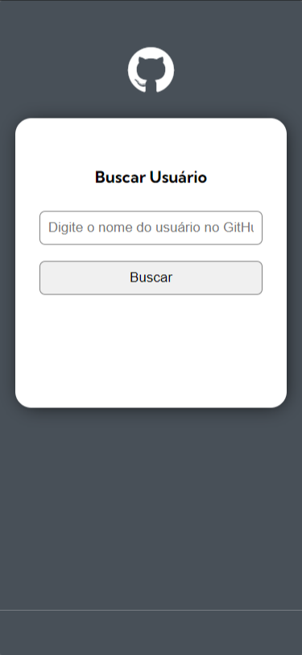

# Busca Ultilizando API do GitHub

Este é um desafio proposto no curso do [Dev em Dobro(DevQuest)](https://www.instagram.com/devemdobro)

## Índice

- [Visão geral](#visão-geral)
   - [O desafio](#o-desafio)
   - [Captura de tela](#captura-de-tela)
- [Meu processo](#meu-processo)
   - [Construído com](#construído-com)
   - [O que aprendi](#o-que-aprendi)
- [Autor](#autor)

## Visão geral

### O desafio
Este desafio foi proposto para melhorar e testar minhas habilidades e foi usado tudo que estudei nos modulos anteriores, o desafio basea-se em fazer um mecanismo de busca utilizando a api do github que ao colocarmos o nome do usuario faz-se uma consuta ao usuario, que inclui, nome, bio, foto, os 10 primeiros repositorios, quantidade de forks, watchers, star e qual liguagem foi feita, também mostra os ultimos eventos

Os usuários devem ser capazes de:

- Fazer uma breve consulta ao usuario que desajar
- Ver o layout ideal em varios tipos de tela
- Ser redirecionado para a page do repositorio desejado ao clicar

### Captura de tela





## Meu processo

### Construído com

- Marcação HTML5 semântica
- Propriedades personalizadas CSS
- Flexbox
- Grid
- Metodos e funções em JavaScript para a interação
- Manipulação do DOM
- Solicitações Fetch
- Funções Assincronas e Sincronas

### O que eu aprendi

Aprendi muito sobre importação e exportação do codigo entre os arquivos, melhorei bastante na manipulação do DOM, aprendi sobre JSON e entendi melhor o conceito das APIs, solicitações fetch, post e get e não posso esquecer das tecnicas com clean code que me ajudaram na clareza do meu codigo.

```js
import {getUser} from "/src/scripts/services/user.js"
import {eventsUser} from "/src/scripts/services/events.js"
import {getRepositories} from "/src/scripts/services/repositories.js"
import {user} from "/src/scripts/objects/user.js"
import {screen} from "/src/scripts/objects/screen.js"

document.getElementById(`btn-search`).addEventListener(`click`, () => {
    const userName = document.getElementById(`input-search`).value

    if (validateEmptyInput(userName)) return
    getUserData(userName)
})

document.getElementById(`input-search`).addEventListener(`keyup`, (event) => {
    const userName = event.target.value
    const key = event.which || event.keyCode
    const isEnterKeyPressed = key === 13

    if (validateEmptyInput(userName)) return

    if (isEnterKeyPressed) {
        getUserData(userName)
    }
})

function validateEmptyInput(userName) {
    if(userName.length === 0) {
        alert(`Preencha o campo com o nome do usuario do GitHub!`)
        return true
    }
}
async function getUserData(userName) {
    const userResponse = await getUser(userName)
    if(userResponse.message === 'Not Found') {
        screen.renderNotFound()
        return
    }

    const repositoriesResponse = await getRepositories(userName)
    const eventsResponse = await eventsUser(userName) 

    user.setInfo(userResponse)
    user.setRepositories(repositoriesResponse)
    user.setEvents(eventsResponse)

    screen.renderUser(user)
}
```
## NOTA:

- Dificil escolher uma parte do codigo que me orgulho, ja que estou orgulho de tudo que fiz nesse projeto então apenas vou colocar a primeira parte :)
- Este projeto demorou um pouco para sair ja que estava muito ocupado com o trabalho e a faculdade, mas mesmo assim consegui aprender bastante.

## Autor

- Linkedin - [Luis Fernando Macedo](https://www.linkedin.com/in/luis-fernando-macedo-dev)
- Instagram - [Luis Fernando](https://www.instagram.com/luis._.fernand0_)